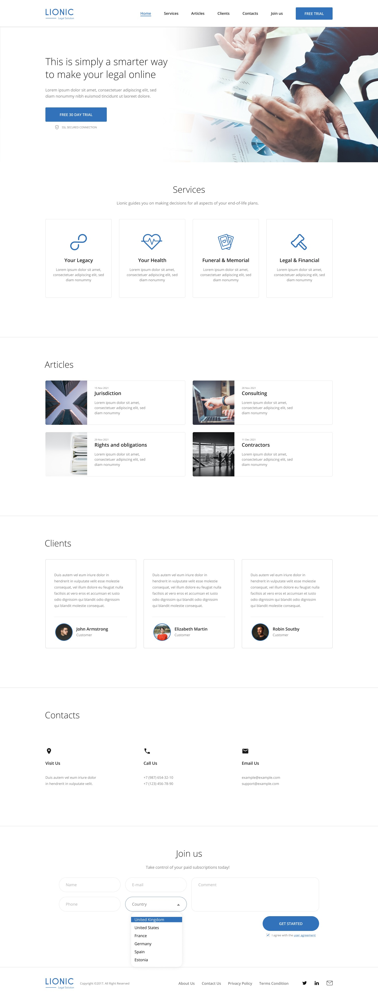

## Сайт, LIONIC Legal Solution

Это одностраничный сайт сделан по макету из [figma](https://www.figma.com/design/gXhAwx9HUyNDizb7zGo63Q/Lionic-(Copy)-(Community)?node-id=0-1&t=RdlCMBPMITD4kkwf-0)/[Pixso](https://pixso.net/app/editor/Np_I-_A5tBcJ_91bjNggOg?icon_type=1&page-id=0%3A1&item-id=1%3A30), резиновая адаптивная верстка, для расположения блоков на сайте был использован flexbox. 

> #### Стек технологий:
> HTML5, CSS3,

